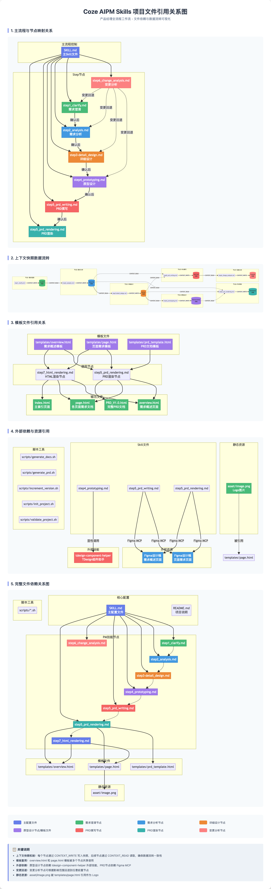

# AIPM - AI 产品经理助手

一个基于Coze平台构建的全流程产品管理助手，能够将模糊、不完整的需求逐步转化为结构化、可执行的产品需求文档（PRD）。

## 功能特色

✅ 6节点标准流程：需求澄清 → 需求分析 → 详细设计 → 原型制作 → PRD撰写 → 变更分析  
✅ 独立变更分析节点 - 增量变更无需整体回退  
✅ 三级用户确认机制  
✅ 完整状态持久化可追溯  
✅ 历史版本永久保留  
✅ 上下文快照管理 - 确保节点间信息传递的一致性  

## 核心文件

- [SKILL.md](./SKILL.md) - 核心工作流程与节点流转逻辑
- [STATE_RULES.md](./STATE_RULES.md) - 状态维护、版本管理、确认机制等技术规范
- [MANUAL.md](./MANUAL.md) - 完整操作手册

## 目录结构

```
coze-AIPM-skills/
├── MANUAL.md                # AIPM操作手册
├── README.md                # 项目说明文档
├── SKILL.md                 # 主技能文件，包含核心工作流程与节点流转逻辑
├── STATE_RULES.md           # 状态维护、版本管理、确认机制等技术规范
├── aipm_skill_flow.html     # AIPM工作流程可视化网页
├── scripts/                 # 自动化脚本（原 src/utils/）
│   ├── generate_docs.sh     # 文档生成脚本
│   ├── generate_prd.sh      # PRD生成脚本
│   ├── increment_version.sh # 版本递增脚本
│   ├── init_project.sh      # 项目初始化脚本
│   └── validate_project.sh  # 项目验证脚本
├── references/              # 参考文档（原 src/nodes/ + src/core/）
│   ├── step1_clarify.md     # 需求澄清节点
│   ├── step2_analysis.md    # 需求分析节点
│   ├── step3-detail_design.md # 详细设计节点
│   ├── step4_prototyping.md # 原型制作节点
│   ├── step5_prd_writing.md # PRD撰写节点
│   ├── step6_change_analysis.md # 变更分析节点
│   ├── overview.html        # 概览页面模板
│   ├── page.html            # 页面模板
│   └── prd_template.html    # PRD文档模板
└── assets/                  # 静态资源（原 src/assets/）
    ├── delegation.png       # 委托关系图
    ├── flow.png             # 流程图
    └── image.png            # 其他图片资源
```

## 输出目录结构

```
/AIPM/{project_name}_{date}/
├── Memory.md                           # [核心] 项目状态与上下文记忆文件
├── draft/                             # [设计区] 放置中间产物、草稿与原型
│       └── PrePRD_V{version}_{date}.md # 初始PRD草稿 (含需求澄清、分析、详细设计)
└── output/                             # [产出区] 最终交付物目录
    └── V{version}_{date}/              # 发布版本目录
        ├── PrePRD_V{version}_{date}.md # 复制最新版本的PrePRD文件
        ├── doc/                        # 交付文档目录
        │   ├── PRD_V{version}_{date}.html  # 最终版PRD文档 (HTML格式)
        │   ├── overview.html               # 项目概览文档
        │   ├── web/                        # B端交付文档
        │   │   └── list.html               # B端页面列表与功能说明
        │   └── app/                        # C端交付文档
        │       └── home.html               # C端页面列表与功能说明
        └── html/                       # 交付原型代码目录
            ├── overview.html           # 项目概览页面
            ├── web/                    # B端原型代码
            │   └── list.html           # B端页面代码与交互演示
            └── app/                    # C端原型代码
                └── home.html           # C端页面代码与交互演示
```


## 使用方法

```
# 启动新需求
我需要做一个用户注册功能
只做需求澄清就可以了
执行到详细设计阶段

# 提出变更
我想调整一下登录逻辑
需要增加微信登录选项
```

发送任意消息自动恢复上次任务进度。


# 文件依赖关系
