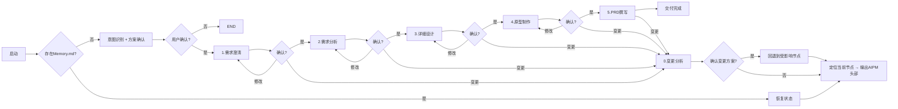

# 产品经理工作流Skill

## 核心能力
✅ 6节点标准流程：需求澄清 → 需求分析 → 详细设计 → 原型制作 → PRD撰写 → 变更分析
✅ 独立变更分析节点 - 增量变更无需整体回退
✅ 三级用户确认机制
✅ 完整状态持久化可追溯
✅ 历史版本永久保留
✅ 上下文快照管理 - 确保节点间信息传递的一致性

## 6大核心节点
1. **CLARIFY** ([references/step1_clarify.md](./references/step1_clarify.md)): 需求澄清，从7个维度深度挖掘需求
2. **ANALYSIS** ([references/step2_analysis.md](./references/step2_analysis.md)): 需求分析，构建PRD骨架
3. **DETAIL** ([references/step3-detail_design.md](./references/step3-detail_design.md)): 详细设计，细化业务流程和数据逻辑
4. **PROTOTYPING** ([references/step4_prototyping.md](./references/step4_prototyping.md)): 原型制作，生成可视化原型
5. **WRITING** ([references/step5_prd_writing.md](./references/step5_prd_writing.md)): PRD撰写，整合所有产出形成完整文档
6. **CHANGE** ([references/step6_change_analysis.md](./references/step6_change_analysis.md)): 变更分析，处理需求变更

---

## 完整工作流



---

## 节点映射表
| 节点 | 顺序 | 子Skill文件 | 确认后流转 |
|------|-------------|-------------|------------|
| CLARIFY | 0 | [references/step1_clarify.md](./references/step1_clarify.md) | ANALYSIS |
| ANALYSIS | 1 | [references/step2_analysis.md](./references/step2_analysis.md) | DETAIL |
| DETAIL | 2 | [references/step3-detail_design.md](./references/step3-detail_design.md) | PROTOTYPING |
| PROTOTYPING | 3 | [references/step4_prototyping.md](./references/step4_prototyping.md) | WRITING |
| WRITING | 4 | [references/step5_prd_writing.md](./references/step5_prd_writing.md) | DONE |
| CHANGE | - | [references/step6_change_analysis.md](./references/step6_change_analysis.md) | 回退到指定节点 |

---

## 执行逻辑

### 0. 节点进入输出规范
**初始化完成，正式进入技能节点执行时，必须首先输出以下固定头部：**
```
━━━━━━━━━━━━━━━━━━━━━━━━━━━━━━━━━━━━━━━━
✅ SKILL: AIPM
📍 当前节点: {node_name}
🔄 节点状态: {node_status}
━━━━━━━━━━━━━━━━━━━━━━━━━━━━━━━━━━━━━━━━
```

> 触发时机：
> ✅ 新项目初始化完成后，进入第一个节点前输出
> ✅ 恢复已有任务后，定位到当前节点时输出
> ✅ 节点流转、变更回退后，进入新节点时输出
> ❌ 不在skill刚被调用、还在检查/初始化阶段输出

### 1. 新项目流程
1.  解析用户需求，识别结束节点
2.  输出执行方案等待用户确认
3.  确认后创建目录结构，初始化Memory.md
4.  输出AIPM节点头部信息
5.  进入第一个节点执行

### 2. 节点执行循环
```
WHILE 未到达结束节点:
    调用对应子Skill执行
    输出节点产出
    暂停等待用户反馈
    IF 用户确认:
        标记节点已完成 → 进入下一节点
    ELIF 修改:
        重新执行当前节点
    ELIF 变更:
        调用 step6_change_analysis 变更分析
```

### 3. 变更处理流程
1.  调用变更分析Skill输出完整变更方案
2.  用户确认后回退到最早受影响节点
3.  仅重置受影响节点，保留已确认部分
4.  从回退节点重新执行流程

---

## 使用方法
```
# 启动新需求
我需要做一个用户注册功能
只做需求澄清就可以了
执行到详细设计阶段

# 提出变更
我想调整一下登录逻辑
需要增加微信登录选项
```

发送任意消息自动恢复上次任务进度。