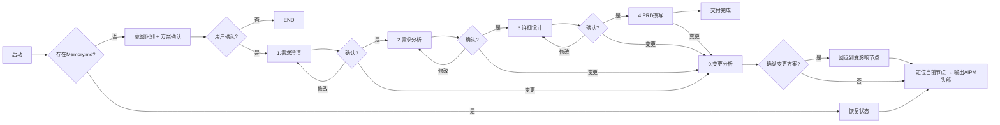

# 产品经理工作流Skill

## 核心能力
✅ 4节点标准流程：需求澄清 → 需求分析 → 详细设计 → PRD撰写
✅ 独立变更分析节点 - 增量变更无需整体回退
✅ 三级用户确认机制
✅ 完整状态持久化可追溯
✅ 历史版本永久保留
✅ 上下文快照管理 - 确保节点间信息传递的一致性

---

## 完整工作流



---

## 节点映射表
| 节点 | 顺序 | 子Skill文件 | 确认后流转 |
|------|-------------|-------------|------------|
| CLARIFY | 0 | step1_clarify.md | ANALYSIS |
| ANALYSIS | 1 | step2_analysis.md | DETAIL |
| DETAIL | 2 | step3-detail_design.md | WRITING |
| WRITING | 3 | step4_prd_writing.md | 结束 |
| CHANGE_ANALYSIS | - | step5_change_analysis.md | 回退到指定节点 |

---

## 执行逻辑

### 0. 节点进入输出规范
**初始化完成，正式进入技能节点执行时，必须首先输出以下固定头部：**
```
━━━━━━━━━━━━━━━━━━━━━━━━━━━━━━━━━━━━━━━━
✅ SKILL: AIPM
📍 当前节点: {node_name}
🔄 节点状态: {node_status}
━━━━━━━━━━━━━━━━━━━━━━━━━━━━━━━━━━━━━━━━
```

> 触发时机：
> ✅ 新项目初始化完成后，进入第一个节点前输出
> ✅ 恢复已有任务后，定位到当前节点时输出
> ✅ 节点流转、变更回退后，进入新节点时输出
> ❌ 不在skill刚被调用、还在检查/初始化阶段输出

### 1. 新项目流程
1.  解析用户需求，识别结束节点
2.  输出执行方案等待用户确认
3.  确认后创建目录结构，初始化Memory.md
4.  输出AIPM节点头部信息
5.  进入第一个节点执行

### 2. 节点执行循环
```
WHILE 未到达结束节点:
    调用对应子Skill执行
    输出节点产出
    暂停等待用户反馈
    IF 用户确认:
        标记节点已完成 → 进入下一节点
    ELIF 修改:
        重新执行当前节点
    ELIF 变更:
        调用 step5_change_analysis 变更分析
```

### 3. 变更处理流程
1.  调用变更分析Skill输出完整变更方案
2.  用户确认后回退到最早受影响节点
3.  仅重置受影响节点，保留已确认部分
4.  从回退节点重新执行流程

---

## 状态管理

### Memory.md 存储结构
```json
{
  "project_name": "",
  "created_at": "",
  "updated_at": "",
  "node_list": [
    {"node_name": "", "order": 0, "is_confirmed": false, "completed_at": null}
  ],
  "current_node": "",
  "current_node_status": "INIT/DRAFT",
  "end_node": "",
  "change_history": [],
  "conversation_log": [],
  "version": 1
}
```

### 状态操作规则
- 每次Skill启动首先读取状态
- 定位到当前节点后输出AIPM头部信息
- 所有状态变更立即持久化
- 对话日志仅追加不修改
- 每次写入前自动备份历史版本

---

## 上下文快照管理

### 快照标签机制
在调用技能生成节点产出物时，需要在上下文中写入节点产出物和快照标签，以确保LLM在读取上下文内容时获取到的都是节点最新的输出内容。

逻辑是根据节点最新的快照标签内容作为生成依据，每个节点都有对应的CURRENT_SNAPSHOT_标签：

| 节点 | 快照标签 |
|------|----------|
| CLARIFY | CURRENT_SNAPSHOT_CLARIFY |
| ANALYSIS | CURRENT_SNAPSHOT_ANALYSIS |
| DETAIL | CURRENT_SNAPSHOT_DETAIL |
| WRITING | CURRENT_SNAPSHOT_WRITING |
| CHANGE | CURRENT_SNAPSHOT_CHANGE |

### 快照行为规则
- 每个节点完成时，必须在上下文中写入对应的快照标签
- 后续节点在执行时，优先读取相关的快照标签内容作为上下文输入
- 快照标签内容应包含该节点的关键决策、产出物和重要信息摘要
- 当节点被重新执行时，对应的快照标签会被新的内容覆盖

---

## 版本管理

### 版本递增机制
- 每次节点内容被编辑或更新时，系统会自动生成新版本的文档
- 版本号按顺序递增（V1, V2, V3...）
- 所有格式的文档（MD, HTML）均生成对应版本

### 版本文件命名规范
- Markdown PRD: `V{version}_{date}.md`
- C端 HTML: `C端_V{version}_{date}.html`
- B端 HTML: `B端_V{version}_{date}.html`
- 综合PRD HTML: `PRD_V{version}_{date}.html`

---

## 确认机制

| 场景 | 确认等级 | 要求 |
|------|----------|------|
| 执行方案、节点通过、变更执行 | 🔴 强确认 | 必须明确"确认/同意" |
| 修改重跑 | 🟡 弱确认 | 重新询问用户意见,重新生成 |
| 查询、查看历史 | 🟢 无需确认 | 直接执行 |

---

## 项目初始化与验证脚本

### 项目创建脚本
当用户启动新项目时，系统将自动执行以下脚本创建目录结构：

```bash
# 执行项目初始化脚本
./scripts/init_project.sh <project_name>
```

此脚本将:
- 创建完整的项目目录结构
- 初始化 Memory.md 文件
- 创建快照、文档、资源等所有必需的子目录
- 生成时间戳备份文件
- 初始化版本号为1

### 项目恢复脚本
当用户恢复现有项目时，系统将执行以下脚本验证目录结构：

```bash
# 执行项目验证脚本
./scripts/validate_project.sh <project_name>
```

此脚本将:
- 验证项目目录结构完整性
- 检查必需文件是否存在
- 如发现缺失目录或文件，自动创建缺失的组件
- 从现有 Memory.md 文件恢复项目状态
- 创建新版本的文档并递增版本号

### 版本递增脚本
每当有内容编辑或更新时，执行以下脚本生成新版本：

```bash
# 递增项目版本并生成新文档
./scripts/increment_version.sh <project_name>
```

此脚本将:
- 读取当前版本号并递增
- 创建新版本的 Markdown 和 HTML 文档
- 更新 version.json 文件中的版本号

---

## 强制规则
1.  节点输出后必须暂停等待确认
2.  变更必须先分析再执行
3.  所有状态变更先获得用户确认
4.  历史版本永不覆盖
5.  未确认前绝不自动流转

---

## 使用方法
```
# 启动新需求
我需要做一个用户注册功能
只做需求澄清就可以了
执行到详细设计阶段

# 提出变更
我想调整一下登录逻辑
需要增加微信登录选项
```

发送任意消息自动恢复上次任务进度。