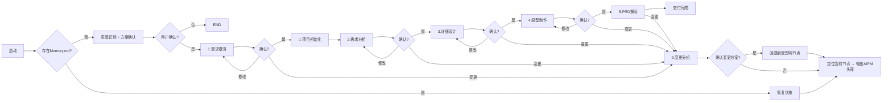

🚨🚨🚨🚨🚨🚨🚨🚨🚨🚨🚨🚨🚨🚨🚨🚨🚨🚨🚨🚨🚨🚨🚨🚨🚨🚨🚨🚨🚨🚨🚨🚨🚨🚨🚨🚨🚨🚨🚨🚨🚨🚨🚨
🚨 强制要求：请先完整阅读以下内容，再执行任何操作！
🚨🚨🚨🚨🚨🚨🚨🚨🚨🚨🚨🚨🚨🚨🚨🚨🚨🚨🚨🚨🚨🚨🚨🚨🚨🚨🚨🚨🚨🚨🚨🚨🚨🚨🚨🚨🚨🚨🚨🚨🚨🚨🚨

## 🚨 强制动作 0：阅读初始化流程规范

**在执行任何操作之前，必须首先阅读：**
👉 [references/initialization_flow.md](references/initialization_flow.md)

**核心要点（必须记住）：**
- ❌ 不要在项目开始时就初始化
- ❌ 不要执行沙箱脚本（`./scripts/init_project.sh`）
- ❌ 不要使用沙箱路径（`/AIPM/`）
- ❌ **不要指导用户手动创建**
- ✅ 要在 **CLARIFY 节点完成后** 才初始化
- ✅ **要智能体直接创建**文件和目录
- ✅ 要使用 **相对路径**（`./` 开头）

---

## 🚨 强制动作 1：阅读目录创建指南

**然后必须读取：**
👉 [references/directory_creation_guide.md](references/directory_creation_guide.md)

---

## 🚨 强制动作 2：阅读流程强制锁

**然后必须读取：**
👉 [references/flow_enforcement_lock.md](references/flow_enforcement_lock.md)

---

## 🚨 强制动作 3：阅读严格执行协议

**然后必须读取：**
👉 [references/strict_execution_protocol.md](references/strict_execution_protocol.md)

---

## 🚨 强制动作 4：阅读状态管理规则

**然后必须读取：**
👉 [STATE_RULES.md](STATE_RULES.md)

---

## 🚨 强制动作 5：阅读节点切换指南

**然后必须读取：**
👉 [references/node_transition_guide.md](references/node_transition_guide.md)

---

## 🚨 节点切换强制规则（重点）

### 🚨 用户确认后必须立即做的 3 件事：

```
用户说："确认"、"没问题"、"继续"
    ↓
1. 立即更新 Memory.md（current_node 改为下一个节点）
    ↓
2. 立即输出 AIPM 头部信息（显示新的当前节点）
    ↓
3. 立即开始执行下一个节点流程
```

### 🚨 绝对禁止：

- ❌ 用户确认后，询问用户"接下来要做什么？"
- ❌ 用户确认后，询问用户"是否进入下一个节点？"
- ❌ 用户确认后，总结当前节点但不进入下一个节点
- ❌ 跳过任何节点
- ❌ 随意跳转节点

### 🚨 节点顺序（绝对不可改变）：

```
CLARIFY (1.需求澄清)
    ↓
ANALYSIS (2.需求分析)
    ↓
DETAIL (3.详细设计)
    ↓
PROTOTYPING (4.原型制作)
    ↓
WRITING (5.PRD撰写)
```

---

🚨🚨🚨🚨🚨🚨🚨🚨🚨🚨🚨🚨🚨🚨🚨🚨🚨🚨🚨🚨🚨🚨🚨🚨🚨🚨🚨🚨🚨🚨🚨🚨🚨🚨🚨🚨🚨🚨🚨🚨🚨🚨🚨
🚨 以上强制要求阅读完成后，再继续阅读下文！
🚨🚨🚨🚨🚨🚨🚨🚨🚨🚨🚨🚨🚨🚨🚨🚨🚨🚨🚨🚨🚨🚨🚨🚨🚨🚨🚨🚨🚨🚨🚨🚨🚨🚨🚨🚨🚨🚨🚨🚨🚨🚨🚨

---
name: product_manager
description: 产品经理全流程工作流，从模糊需求到标准PRD完整链路；当用户进入产品需求分析全流程包括需求澄清、需求分析、详细需求设计、原型设计、PRD生成以及需求变更场景时触发。
---

# 产品经理工作流Skill

## 📌 [coze渠道] 版本说明
**版本：V2.6**

**本次更新内容：**
1. ✅ Step 5 增加校验步骤：检查是否遗漏文件、是否生成 PRD 查看器
2. ✅ PRD 查看器文件命名规范：`PRD查看器_{version}_{datetime}.html`
3. ✅ 新增打包步骤：生成压缩包，命名为 `{项目名称}_{version}_{datetime}.zip`
4. ✅ 压缩包保存位置：工作目录 + 沙箱目录
5. ✅ 发送压缩包给用户，并提示线上预览限制
6. ✅ Step4 显式禁止后台任务：所有操作必须在前台同步执行
7. ✅ Step4 强制实时打印内容：Mock数据、ASCII线框图、HTML原型必须实时打印在消息中
8. ✅ Step5 速度优化：如果 Step4 未生成原型，Step5 快速生成简化版，跳过 Mock 数据和外部技能调用
9. ✅ **Step4 引用优化**：优化 tdesign-component-helper Skill 的引用方式，支持 Skill 已安装/未安装两种场景

本版本通过 coze 渠道构建和维护，包含完整的流程强制锁机制。

## 🚨 最高优先级：初始化流程规范（必须首先阅读）

**🚨 在执行任何操作之前，必须首先阅读并严格遵守：[references/initialization_flow.md](references/initialization_flow.md)**

**⚠️ 初始化时机：CLARIFY 节点完成后！**

**关键规则（必须记住）：**
1. ❌ 不要在项目开始时就初始化
2. ❌ 不要执行沙箱脚本（`./scripts/init_project.sh`）
3. ❌ 不要使用沙箱路径（`/AIPM/`）
4. ❌ **不要指导用户手动创建**
5. ✅ 要在 **CLARIFY 节点完成后** 才初始化
6. ✅ **要智能体直接创建**文件和目录
7. ✅ 要使用 **相对路径**（`./` 开头）
8. ✅ 要确保所有文件用户都能访问

---

## 🚨 第二优先级：流程强制锁（必须首先阅读）

**🚨 在执行任何操作之前，必须首先读取并严格遵守：[references/flow_enforcement_lock.md](references/flow_enforcement_lock.md)**

**⚠️ 本文档优先级最高，高于所有其他文档！任何情况下不得违反！**

**关键规则：**
1. ✅ 每次对话前3个动作（检查Memory → 读取状态 → 确定节点）
2. ✅ 必须输出 AIPM 头部信息
3. ✅ 必须严格按节点顺序执行（CLARIFY → ANALYSIS → DETAIL → PROTOTYPING → WRITING）
4. ✅ 每个节点必须等待用户明确"确认"才能前进
5. ✅ 绝对禁止跳过任何节点
6. ✅ 违规3次必须调用人类审核

---

## 🚨 第二优先级：严格执行协议

**在阅读流程强制锁后，还需阅读：[references/strict_execution_protocol.md](references/strict_execution_protocol.md)**

---

## 🚨 第三优先级：状态维护与规则管理

**在阅读以上协议后，还需阅读：[STATE_RULES.md](STATE_RULES.md)**

**该文件定义了完整的状态管理、上下文快照和版本管理规则！**

---

## 核心能力
✅ 9节点标准流程：路由 → 头脑风暴 → 需求澄清 → 需求分析 → 详细设计 → 项目初始化 → 原型制作 → PRD撰写 → 变更分析
✅ 独立变更分析节点 - 增量变更无需整体回退
✅ 三级用户确认机制
✅ 完整状态持久化可追溯
✅ 历史版本永久保留
✅ 上下文快照管理 - 确保节点间信息传递的一致性

---

## 9大核心节点
1. **ROUTER** ([nodes/01-router.md](nodes/01-router.md)): 入口路由器，定义全局执行规范和节点概览
2. **BRAINSTORM** ([nodes/02-brainstorm.md](nodes/02-brainstorm.md)): 头脑风暴，自由发散思维
3. **CLARIFY** ([nodes/03-clarify.md](nodes/03-clarify.md)): 需求澄清，从7个维度深度挖掘需求
4. **ANALYSIS** ([nodes/04-analysis.md](nodes/04-analysis.md)): 需求分析，构建PRD骨架
5. **DETAIL** ([nodes/05-detail.md](nodes/05-detail.md)): 详细设计，细化业务流程和数据逻辑
6. **INIT** ([nodes/06-init.md](nodes/06-init.md)): 项目初始化，创建目录结构和Memory.md
7. **PROTOTYPING** ([nodes/07-prototyping.md](nodes/07-prototyping.md)): 原型制作，生成可视化原型（优先使用欧莱雅兰蔻Mock数据）
8. **WRITING** ([nodes/08-writing.md](nodes/08-writing.md)): PRD撰写，整合所有产出形成完整文档
9. **CHANGE** ([nodes/09-change.md](nodes/09-change.md)): 变更分析，处理需求变更

> **注意**：manage 节点（状态管理中心）将在后续迭代中单独实现

---

## 完整工作流



---

## 节点映射表
| 序号 | 节点 | 用户确认 | 子Skill文件 | 确认后流转 |
|------|------|---------|-------------|------------|
| 01 | ROUTER | - | nodes/01-router.md | 入口，无状态管理 |
| 02 | BRAINSTORM | ✓ | nodes/02-brainstorm.md | CLARIFY |
| 03 | CLARIFY | ✓ | nodes/03-clarify.md | ANALYSIS |
| 04 | ANALYSIS | ✓ | nodes/04-analysis.md | DETAIL |
| 05 | DETAIL | ✓ | nodes/05-detail.md | INIT |
| 06 | INIT | ✗ | nodes/06-init.md | PROTOTYPING（无需确认）|
| 07 | PROTOTYPING | ✓ | nodes/07-prototyping.md | WRITING |
| 08 | WRITING | ✓ | nodes/08-writing.md | DONE |
| 09 | CHANGE | - | nodes/09-change.md | 回退到指定节点 |

> **注意**：manage 节点（状态管理中心）将在后续迭代中单独实现

---

## 资源索引
- **初始化流程规范**: 见 [references/initialization_flow.md](references/initialization_flow.md)(🚨 最高优先级，CLARIFY完成后初始化)
- **路径配置指南**: 见 [references/path_config_guide.md](references/path_config_guide.md)(澄清沙箱环境与用户工作目录区别)
- **欧莱雅兰蔻Mock数据**: 见 [references/loreal_mock_database.md](references/loreal_mock_database.md)(美妆项目优先使用)
- **文件保存规范**: 见 [references/file_management_spec.md](references/file_management_spec.md)(Step3/4/5立即保存文件)
- **目录创建指南**: 见 [references/directory_creation_guide.md](references/directory_creation_guide.md)(🚨 最高优先级，强制创建目录结构)
- **流程强制锁**: 见 [references/flow_enforcement_lock.md](references/flow_enforcement_lock.md)(第二优先级)
- **严格执行协议**: 见 [references/strict_execution_protocol.md](references/strict_execution_protocol.md)(第三优先级)
- **状态管理规则**: 见 [STATE_RULES.md](STATE_RULES.md)(第四优先级，状态管理、上下文快照和版本管理)
- **领域参考**: 见 [references/](references/)(何时读取:各节点执行时参考对应的步骤文档)
- **静态资源**: 见 [assets/](assets/)(资源文件和模板)
- **工具脚本**: 见 [scripts/](scripts/)(项目初始化、验证、文档生成和版本管理 - 仅作参考)