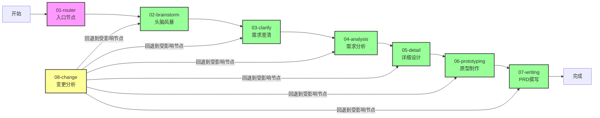

# Nodes Directory

AIPM Skill 节点文件目录

## 文件命名规范

线性节点文件命名：`{序号}-{node_name}.md`
内部共享能力文件命名：`_manage.md`（下划线前缀表示内部使用）

示例：
- `01-router.md`
- `02-brainstorm.md`
- `_manage.md`（内部能力，供其他节点调用）

## 节点执行流程

## 节点概览

| 执行顺序 | 节点名称 | 文件名 | 用户确认 | 核心职责 | 产出物 |
|----------|----------|--------|---------|----------|--------|
| 1 | router | 01-router.md | 否 | 项目初始化、状态恢复 | 项目目录结构、Memory.json |
| 2 | brainstorm | 02-brainstorm.md | 是 | 需求发散、功能框架搭建 | 头脑风暴文档 |
| 3 | clarify | 03-clarify.md | 是 | 7维度需求挖掘、边界确认 | 需求澄清文档 |
| 4 | analysis | 04-analysis.md | 是 | PRD骨架、业务流程设计 | 需求分析文档 |
| 5 | detail | 05-detail.md | 是 | 页面流程、事件定义、流程图 | 详细设计文档 |
| 6 | prototyping | 06-prototyping.md | 是 | 高保真HTML原型制作 | 可交互原型文件 |
| 7 | writing | 07-writing.md | 是 | PRD整合、交互式查看器生成 | 完整PRD文档系统 |
| 8 | change | 08-change.md | 是 | 变更影响分析、增量更新 | 变更分析报告 |
| - | _manage | _manage.md | - | 内部共享能力、状态管理 | 内部接口 |

## 内部共享能力

### _manage.md

`product_manager/nodes/_manage.md` 是内部共享能力，供其他节点调用，不作为独立节点执行。

**职责：**
- 状态管理：节点状态机（DRAFT/CONFIRM）、节点流转、需求变更路由
- 记忆管理：上下文快照读写、Memory.json 持久化
- 版本管理：版本号查询和递增

**调用时机：**
在以下节点完成后自动调用（无需用户确认）：
- brainstorm ✓ → manage.update_node_status + manage.transition_to_next_node
- clarify ✓ → manage.update_node_status + manage.transition_to_next_node
- analysis ✓ → manage.update_node_status + manage.transition_to_next_node
- detail ✓ → manage.update_node_status + manage.transition_to_next_node
- prototyping ✓ → manage.update_node_status + manage.transition_to_next_node
- writing ✓ → manage.update_node_status + manage.transition_to_next_node
- change ✓ → manage.update_node_status + manage.transition_to_first_affected_node
✓ = 用户已确认
